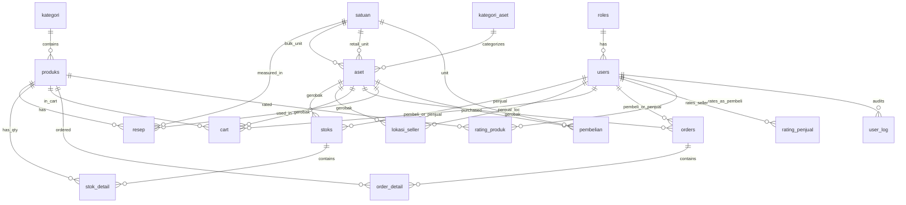

# Pizza Backend — API Documentation

Reference for integrating this Laravel + Sanctum API with a Vue.js (or other) frontend.

> Last updated from repo commits through `a817b1e` (checkout `$$saveOrder` fix; doc sync with implementation details).

---

## Base setup

| Item | Value |
|------|--------|
| Base URL | `{APP_URL}/api` (e.g. `http://localhost:8000/api`) |
| Auth | Laravel Sanctum — Bearer token |
| Headers | `Content-Type: application/json`, `Accept: application/json`, `Authorization: Bearer {token}` |
| Health check | `GET /up` (not under `/api`) |

### Roles (from seeder)

| id | slug | name |
|----|------|------|
| 1 | `admin` | admin |
| 2 | `penjual` | penjual |
| 3 | `pembeli` | pembeli |
| 4 | `mitra` | mitra |

Protected routes use role middleware. Wrong role receives **403**:

```json
{ "message": "Anda tidak memiliki akses ke halaman ini." }
```

| Middleware | Routes |
|------------|--------|
| `role:admin` | User management, produk/stok/satuan/aset/kategori/resep, admin `lokasiPenjual` CRUD, `POST/PUT /konfigurasi/*` |
| `role:penjual` | `POST /lokasiPenjual/updateLokasiPenjual`, `POST /order/checkoutPesanan`, `POST /order/updatePesanan` |
| `role:pembeli` | Keranjang (cart), `GET /lokasiPenjual/getPenjualByLokasiId/{id}`, `GET /stoks/getProdukByPenjual/{id}`, `POST /order/checkoutPesanan`, `POST /ratingPenjual/simpan`, `POST /ratingProduk/simpan` |
| Any authenticated user | `/logout`, `/user` |
| Public (no token) | `/register`, `/login`, `/produks`, `/stoks`, `/lokasiPenjual/getPenjualByLatLong`, `GET /konfigurasi` |

---

## Access levels

```mermaid
flowchart LR
    subgraph public [Public - no token]
        A[POST /register]
        B[POST /login]
        C[GET /produks]
        D[GET /produks/id]
        E[GET /stoks]
        R[GET /lokasiPenjual/getPenjualByLatLong]
        W[GET /konfigurasi]
    end
    subgraph auth [Auth required]
        F[POST /logout]
        G[GET /user]
    end
    subgraph penjual [Penjual only]
        T[POST /lokasiPenjual/updateLokasiPenjual]
        X[POST /order/checkoutPesanan]
        Y[POST /order/updatePesanan]
    end
    subgraph pembeli [Pembeli only]
        Q[keranjang GET POST PUT DELETE]
        U[getPenjualByLokasiId]
        V[getProdukByPenjual]
        S[POST /order/checkoutPesanan]
        Z[ratingPenjual ratingProduk simpan]
    end
    subgraph admin [Admin only]
        H[produks POST PUT]
        I[stoks POST simpanBatch]
        J[satuan resource]
        K[aset resource + getAsetByKategoriAset]
        L[kategoriMenu resource]
        M[kategoriAset resource]
        N[resep endpoints]
        O[lokasiPenjual CRUD]
        P[user penjual GET POST PUT]
        K2[konfigurasi POST PUT]
    end
    public --> auth
    auth --> penjual
    auth --> pembeli
    auth --> admin
```



---

## Database tables & fields

### `roles`

| Field | Type | Notes |
|-------|------|-------|
| id | bigint | PK |
| name | string | unique |
| slug | string | unique — used for auth checks |
| created_at, updated_at | datetime | |

### `users`

| Field | Type | Notes |
|-------|------|-------|
| id | bigint | PK |
| role_id | bigint | FK → roles |
| name | string | |
| email | string | unique |
| email_verified_at | datetime | nullable |
| password | string | hidden in JSON |
| lat | decimal(10,8) | nullable |
| long | decimal(11,8) | nullable |
| notelp | string | nullable — phone number |
| aktif | boolean | default `true` |
| status_lapak | boolean | default `false` — seller stall open/closed |
| kode_penjual | text | nullable — auto-generated for penjual role (e.g. `001`) |
| created_at, updated_at | datetime | |

**Hidden in API:** `password`, `remember_token`

### `kategori` (product / menu categories)

| Field | Type | Notes |
|-------|------|-------|
| id | bigint | PK |
| nama_kategori | string | unique |
| slug | string | unique |
| tipe_kategori | string | |
| prioritas | integer | sort order |
| aktif | boolean | default `true` |
| created_at, updated_at | datetime | |

### `produks` (products)

| Field | Type | Notes |
|-------|------|-------|
| id | bigint | PK |
| kategori_id | bigint | FK → kategori |
| nama_produk | string | |
| slug | string | unique |
| taste_note | text | nullable |
| deskripsi | text | nullable |
| hpp | decimal(12,2) | cost (Harga Pokok Penjualan) |
| margin | decimal(12,2) | profit margin |
| harga | decimal(12,2) | selling price |
| gambar | text | nullable — image URL/path |
| aktif | boolean | default `true` |
| created_at, updated_at | datetime | |

**Relations in JSON:** `kategori`, `stok_detail`, `resep` (when loaded)

### `stoks` (stock header — per gerobak + penjual + date)

| Field | Type | Notes |
|-------|------|-------|
| id | bigint | PK |
| gerobak_id | bigint | FK → aset (gerobak asset) |
| penjual_id | bigint | FK → users (penjual), nullable |
| tanggal | date | stock date |
| created_at, updated_at | datetime | |

**Relations in JSON:** `users` (penjual — Eloquent relation name), `gerobak` (aset), `detail` (stok_detail lines)

> Stock quantities per product live in `stok_detail`, not on this table.

### `stok_detail` (stock lines — qty per product)

| Field | Type | Notes |
|-------|------|-------|
| id | bigint | PK |
| stok_id | bigint | FK → stoks |
| produk_id | bigint | FK → produks |
| qty | integer | quantity on hand for that stock header |
| created_at, updated_at | datetime | |

**Relations:** belongs to `stok`, `produk` (not always loaded in API responses). JSON key is `stok_detail` on produk; nested lines use field `qty`.

### `satuan` (units)

| Field | Type | Notes |
|-------|------|-------|
| id | bigint | PK |
| nama | text | unit name (kg, liter, etc.) |
| aktif | boolean | default `true` |
| created_at, updated_at | datetime | |

### `kategori_aset` (asset categories)

| Field | Type | Notes |
|-------|------|-------|
| id | bigint | PK |
| nama | string | unique — e.g. Bahan Baku, Aset Fisik, Gerobak |
| slug | string | unique |
| aktif | boolean | default `true` |
| created_at, updated_at | datetime | |

### `aset` (inventory / raw materials / gerobak)

| Field | Type | Notes |
|-------|------|-------|
| id | bigint | PK |
| kategori_aset_id | integer | FK → kategori_aset |
| nama | text | asset name |
| merk | text | nullable, brand |
| qty | decimal(12,2) | bulk quantity |
| satuan_id | integer | FK → satuan (bulk unit) |
| harga | decimal(12,2) | bulk price |
| qty_ecer | decimal(12,2) | retail/smaller unit qty |
| satuan_ecer_id | integer | FK → satuan (retail unit) |
| harga_ecer | decimal(12,2) | retail unit price |
| keterangan | text | nullable |
| aktif | boolean | default `true` |
| kode_gerobak | text | nullable — auto-generated for gerobak assets (e.g. `001`) |
| created_at, updated_at | datetime | |

**Relations in JSON:** `satuan`, `satuan_ecer`

### `resep` (recipe — product ingredients)

| Field | Type | Notes |
|-------|------|-------|
| id | bigint | PK |
| produk_id | integer | FK → produks |
| aset_id | integer | FK → aset |
| satuan_id | integer | FK → satuan |
| qty | decimal(12,2) | amount used |
| harga | decimal(12,2) | cost for this line |
| keterangan | text | nullable |
| created_at, updated_at | datetime | |

### `pembelian` (purchase history for assets)

| Field | Type | Notes |
|-------|------|-------|
| id | bigint | PK |
| aset_id | integer | FK → aset |
| satuan_id | integer | FK → satuan |
| qty | decimal(12,2) | |
| harga | decimal(12,2) | |
| keterangan | text | nullable |
| created_at, updated_at | datetime | |

### `lokasi_seller` (penjual location per gerobak)

| Field | Type | Notes |
|-------|------|-------|
| id | bigint | PK |
| gerobak_id | bigint | FK → aset |
| penjual_id | bigint | FK → users (penjual) |
| provinsi_id | integer | nullable — wilayah ID |
| kota_id | integer | nullable |
| kecamatan_id | integer | nullable |
| kelurahan_id | integer | nullable |
| tanggal | date | location/stock date |
| lat_penjual | decimal(10,8) | nullable — seller GPS latitude |
| long_penjual | decimal(11,8) | nullable — seller GPS longitude |
| created_at, updated_at | datetime | |

**Relations in JSON:** `users` (penjual), `gerobak` (aset)

### `orders` (checkout / pesanan header)

> Laravel model: `Order`. Database table name is **`orders`** (not `order`).

| Field | Type | Notes |
|-------|------|-------|
| id | bigint | PK |
| gerobak_id | bigint | FK → aset |
| penjual_id | bigint | FK → users (penjual) |
| pembeli_id | bigint | FK → users (pembeli), nullable |
| kode_pesanan | text | auto: `PPP` + `kode_gerobak` + `kode_penjual` + `dmY` + daily sequence |
| no_antrian | integer | nullable — queue number for the day |
| metode_pembayaran | text | e.g. `Offline`, `Online` |
| tipe_pembayaran | text | nullable — e.g. `bca`, `bri` |
| status_pembayaran | text | `Belum Melakukan Pembayaran`, `Pembayaran Berhasil`, `Pembayaran Gagal` |
| status_penjual | text | nullable — `Diterima`, `Ditolak` |
| status_order | text | `Pending`, `Selesai`, `Gagal` |
| lat_pembeli | decimal(10,8) | nullable |
| long_pembeli | decimal(11,8) | nullable |
| alamat_pembeli | text | nullable |
| note_pembeli | text | nullable |
| total | decimal(12,2) | `subtotal - diskon` |
| diskon | decimal(12,2) | sum of line discounts |
| subtotal | decimal(12,2) | sum of line totals |
| token_midtrans | text | nullable |
| created_at, updated_at | datetime | |

**Relations in JSON:** `gerobak`, `penjual`, `pembeli`, `orderDetail` (when loaded)

### `order_detail` (order line items)

| Field | Type | Notes |
|-------|------|-------|
| id | bigint | PK |
| order_id | bigint | FK → orders |
| produk_id | bigint | FK → produks |
| harga | decimal(12,2) | unit price at checkout |
| qty | integer | quantity ordered |
| diskon | decimal(12,2) | line discount |
| total | decimal(12,2) | line total before order-level discount |
| created_at, updated_at | datetime | |

### `cart` (shopping cart / keranjang)

| Field | Type | Notes |
|-------|------|-------|
| id | bigint | PK |
| gerobak_id | bigint | FK → aset (gerobak) |
| penjual_id | bigint | FK → users (penjual) |
| pembeli_id | bigint | FK → users (pembeli) |
| produk_id | bigint | FK → produks |
| qty | integer | quantity |
| created_at, updated_at | datetime | |

**Relations in JSON:** `gerobak`, `penjual`, `pembeli`, `produk`

> Unique combination per line: `gerobak_id` + `penjual_id` + `pembeli_id` + `produk_id`. Adding the same combo again **updates** qty instead of duplicating.

### `user_log` (audit trail — internal, no public API)

| Field | Type | Notes |
|-------|------|-------|
| id | bigint | PK |
| user_id | bigint | FK → users |
| ip_address | text | nullable |
| aktivitas | text | activity description |
| perubahan | json | nullable — before/after detail |
| created_at, updated_at | datetime | |

Written automatically by admin/pembeli/penjual mutations (produk, stok, aset, resep, kategori, satuan, user, lokasi penjual, keranjang, order checkout, konfigurasi).

### `konfigurasi` (app settings)

| Field | Type | Notes |
|-------|------|-------|
| id | bigint | PK |
| nama_app | text | app name — unique |
| logo_app | text | nullable — logo URL/path |
| created_at, updated_at | datetime | |

> Typically a single-row config. `POST /konfigurasi/simpan` rejects if more than one row already exists.

### `rating_penjual` (seller ratings)

| Field | Type | Notes |
|-------|------|-------|
| id | bigint | PK |
| pembeli_id | bigint | FK → users (pembeli) |
| penjual_id | bigint | FK → users (penjual) |
| rating | integer | score |
| pesan | text | review message |
| created_at, updated_at | datetime | |

### `rating_produk` (product ratings)

| Field | Type | Notes |
|-------|------|-------|
| id | bigint | PK |
| pembeli_id | bigint | FK → users (pembeli) |
| produk_id | bigint | FK → produks |
| rating | integer | score |
| pesan | text | review message |
| created_at, updated_at | datetime | |

---

## API endpoints

### Auth

#### `POST /api/register` — Public

**Body:**

```json
{
  "name": "John Doe",
  "email": "john@example.com",
  "password": "password123",
  "role_id": 3
}
```

**Response 201:**

```json
{
  "data": {
    "id": 5,
    "role_id": 3,
    "name": "...",
    "email": "...",
    "lat": null,
    "long": null,
    "created_at": "...",
    "updated_at": "..."
  },
  "access_token": "1|xxxx",
  "token_type": "Bearer"
}
```

**Response 422:** validation errors object

---

#### `POST /api/login` — Public

**Body:**

```json
{
  "email": "admin@pizza.com",
  "password": "password"
}
```

**Response 200:**

```json
{
  "message": "Login sukses!",
  "access_token": "2|xxxx",
  "role": 1
}
```

> `role` is **`role_id` (number)**, not slug. Map it on the frontend or call `GET /api/user` after login.

**Response 401:**

```json
{ "message": "Email atau password salah!" }
```

---

#### `POST /api/logout` — Auth required

**Response 200:**

```json
{ "success": true, "message": "Berhasil logout" }
```

---

#### `GET /api/user` — Auth required

Returns the logged-in user object (password hidden).

---

#### `GET /api/user/penjual` — Admin only

**Response 200:**

```json
{
  "success": true,
  "message": "Daftar Semua Penjual",
  "data": [ /* users with role slug = penjual */ ]
}
```

---

#### `POST /api/user` — Admin only

Create a user (admin-managed, separate from public `/register`).

**Body:**

```json
{
  "role_id": 2,
  "name": "Penjual Baru",
  "email": "penjual2@pizza.com",
  "password": "password123"
}
```

| Field | Rules |
|-------|-------|
| role_id | required, integer |
| name | required, string, max 255 |
| email | required, string, max 255 |
| password | optional string |

**Response 201:**

```json
{ "success": true, "message": "User berhasil ditambahkan" }
```

**Response 422:**

```json
{ "success": false, "message": "Validasi gagal", "errors": { ... } }
```

---

#### `PUT /api/user/{id}` — Admin only

**Body (all optional via `sometimes`):** `role_id`, `name`, `email`, `password`, `notelp`, `lat`, `long`, `aktif`, `status_lapak` (boolean)

**Response 200:**

```json
{ "success": true, "message": "User berhasil diupdate", "data": { /* user */ } }
```

**Response 404 / 422** on not found / validation failure.

---

### Products (`produks`)

#### `GET /api/produks` — Public

List all products with `kategori` and **`stok_detail`** (filtered to stock headers with `tanggal` = **today**).

**Response 200:**

```json
{
  "success": true,
  "message": "Daftar Data Produk",
  "data": [
    {
      "id": 1,
      "kategori_id": 1,
      "nama_produk": "Pizza Paket Sendirian A",
      "slug": "pizza_paket_sendirian_a",
      "taste_note": "...",
      "deskripsi": "...",
      "hpp": "11000.00",
      "margin": "9000.00",
      "harga": "20000.00",
      "gambar": null,
      "aktif": true,
      "created_at": "...",
      "updated_at": "...",
      "kategori": {
        "id": 1,
        "nama_kategori": "...",
        "slug": "...",
        "tipe_kategori": "",
        "prioritas": 1,
        "aktif": true
      },
      "stok_detail": [
        {
          "id": 1,
          "stok_id": 1,
          "produk_id": 1,
          "qty": 25,
          "created_at": "...",
          "updated_at": "..."
        }
      ]
    }
  ]
}
```

> JSON key is `stok_detail` (snake_case from Eloquent relation `stokDetail`). Empty array if no stock for today.

---

#### `GET /api/produks/{id}` — Public

Product detail with `kategori`. Controller still calls `stok` relation which is **commented out** on the model — stock data may be missing; use `GET /stoks` or filter `stok_detail` separately.

**Response 404:**

```json
{ "success": false, "message": "Produk Tidak Ditemukan!" }
```

---

#### `POST /api/produks` — Admin only

**Body:**

```json
{
  "kategori_id": 1,
  "nama_produk": "Pizza Margherita",
  "slug": "pizza_margherita",
  "taste_note": "Classic",
  "deskripsi": "...",
  "hpp": 15000,
  "margin": 10000,
  "harga": 25000,
  "gambar": "https://example.com/pizza.jpg"
}
```

| Field | Rules |
|-------|-------|
| kategori_id | required, integer |
| nama_produk | required, string, max 255 |
| slug | required, string, max 255 |
| taste_note, deskripsi | optional string |
| hpp, margin | required, **integer** |
| harga | required, numeric |
| gambar | optional string |

**Response 201:**

```json
{ "success": true, "message": "Produk berhasil ditambahkan" }
```

**Response 422:**

```json
{ "success": false, "message": "Validasi gagal", "errors": { ... } }
```

---

#### `PUT /api/produks/{id}` — Admin only

**Body (all optional via `sometimes`):** same fields as create, plus `aktif` (boolean).

**Response 200:**

```json
{ "success": true, "message": "Produk berhasil diupdate", "data": { /* produk */ } }
```

**Response 404 / 422** on not found / validation failure.

---

### Menu categories (`kategoriMenu`) — Admin only (resource routes)

| Method | Endpoint | Description |
|--------|----------|-------------|
| GET | `/api/kategoriMenu` | List active categories (`aktif = true`), ordered by `prioritas` |
| POST | `/api/kategoriMenu` | Create |
| GET | `/api/kategoriMenu/{id}` | Detail |
| PUT/PATCH | `/api/kategoriMenu/{id}` | Update |
| DELETE | `/api/kategoriMenu/{id}` | Delete (blocked if products still use it) |

**POST body:**

```json
{
  "nama_kategori": "Paket Sendirian",
  "slug": "paket_sendiri",
  "tipe_kategori": "",
  "prioritas": 1
}
```

**PUT body (optional fields):** `nama_kategori`, `slug`, `tipe_kategori`, `prioritas`, `aktif` (boolean)

**POST response 201:** `{ "success": true, "message": "Data Kategori Menu berhasil ditambahkan" }`

**DELETE blocked 404:**

```json
{ "success": false, "message": "Masih ada Produk yang menggunakan Kategori Menu ini" }
```

---

### Stock (`stoks`)

#### `GET /api/stoks` — Public

**Response 200:**

```json
{
  "success": true,
  "message": "Daftar Data Stok",
  "data": [
    {
      "id": 1,
      "gerobak_id": 1,
      "penjual_id": 2,
      "tanggal": "2026-05-27",
      "created_at": "...",
      "updated_at": "...",
      "users": { "id": 2, "name": "Penjual Pizza", "email": "...", "role_id": 2 },
      "gerobak": { "id": 1, "nama": "Gerobak 1", "kategori_aset_id": 3, ... }
    }
  ]
}
```

> Each header can include nested `detail` if eager-loaded server-side. Current index loads `users` and `gerobak` only.

---

#### `POST /api/stoks` — Admin only

Creates a single stock header row. Validation still references legacy flat fields — **prefer `POST /stoks/simpanBatch`** for the current schema.

**Body (current controller validation):**

```json
{
  "gerobak_id": 1,
  "penjual_id": 2,
  "produk_id": 1,
  "tanggal": "2026-05-27",
  "stok": 30
}
```

**Response 201:** `{ "success": true, "message": "Stok berhasil ditambahkan", "data": { ... } }`

---

#### `POST /api/stoks/simpanBatch` — Admin only

Creates one `stoks` header, multiple `stok_detail` lines, and multiple `lokasi_seller` rows in a single transaction.

**Body:**

```json
{
  "gerobak_id": 1,
  "penjual_id": 2,
  "tanggal": "2026-06-03",
  "lokasi": [
    {
      "provinsi_id": 11,
      "kota_id": 1101,
      "kecamatan_id": 110101,
      "kelurahan_id": 11010101
    }
  ],
  "produk": [
    { "produk_id": 1, "qty": 25 },
    { "produk_id": 2, "qty": 15 }
  ]
}
```

| Field | Rules |
|-------|-------|
| gerobak_id | required, exists in `aset` |
| penjual_id | required, exists in `users` |
| tanggal | required, format `Y-m-d` |
| lokasi | required array, min 1 item |
| lokasi.*.provinsi_id | optional integer |
| lokasi.*.kota_id | optional integer |
| lokasi.*.kecamatan_id | optional integer |
| lokasi.*.kelurahan_id | optional integer |
| produk | required array, min 1 item |
| produk.*.produk_id | required, exists in `produks` |
| produk.*.qty | required, numeric |

Each `lokasi` row is saved to `lokasi_seller` with the same `gerobak_id`, `penjual_id`, and `tanggal` as the stock header.

**Response 201:**

```json
{ "success": true, "message": "Data stok berhasil disimpan!" }
```

**Response 422:**

```json
{ "success": false, "message": "Validasi gagal", "errors": { ... } }
```

---

#### `GET /api/stoks/getProdukByPenjual/{id}` — Pembeli only

Today's stock for a seller (`penjual_id`), with real-time sold qty per product line.

Each `detail` item includes aggregated **`qty_terjual`** (orders counted: paid + pending within 15 minutes for unpaid). Frontend can compute remaining stock as `qty - qty_terjual`.

**Response 200:**

```json
{
  "success": true,
  "message": "Daftar Data Stok",
  "data": [
    {
      "id": 1,
      "gerobak_id": 1,
      "penjual_id": 2,
      "tanggal": "2026-06-12",
      "users": { "id": 2, "name": "Penjual Pizza", ... },
      "gerobak": { "id": 1, "nama": "Gerobak 1", ... },
      "detail": [
        {
          "id": 1,
          "stok_id": 1,
          "produk_id": 1,
          "qty": 25,
          "qty_terjual": "3"
        }
      ]
    }
  ]
}
```

---

### Units (`satuan`) — Admin only (resource routes)

| Method | Endpoint | Description |
|--------|----------|-------------|
| GET | `/api/satuan` | List units (optional filter) |
| POST | `/api/satuan` | Create |
| GET | `/api/satuan/{id}` | Detail |
| PUT/PATCH | `/api/satuan/{id}` | Update |
| DELETE | `/api/satuan/{id}` | Delete (blocked if used by aset/resep) |

**GET query params:**

| Param | Type | Description |
|-------|------|-------------|
| aktif | boolean | Optional — filter by active status |

Examples: `GET /api/satuan`, `GET /api/satuan?aktif=1`, `GET /api/satuan?aktif=0`

**POST body:**

```json
{ "nama": "kg" }
```

**POST response 201:** `{ "success": true, "message": "Data Satuan berhasil ditambahkan" }`

**PUT response 200:** `{ "success": true, "message": "Data Satuan berhasil diupdate" }`

**DELETE blocked 404:**

```json
{ "success": false, "message": "Masih ada Aset/Resep yang menggunakan Satuan ini" }
```

---

### Asset categories (`kategoriAset`) — Admin only (resource routes)

| Method | Endpoint | Description |
|--------|----------|-------------|
| GET | `/api/kategoriAset` | List active categories |
| POST | `/api/kategoriAset` | Create |
| GET | `/api/kategoriAset/{id}` | Detail |
| PUT/PATCH | `/api/kategoriAset/{id}` | Update |
| DELETE | `/api/kategoriAset/{id}` | Delete (blocked if assets still use it) |

**POST body:**

```json
{
  "nama": "Bahan Baku",
  "slug": "bahan_baku"
}
```

**PUT body (optional):** `nama`, `slug`, `aktif`

**Seeded slugs:** `bahan_baku`, `aset_fisik`, `gerobak`

---

### Assets (`aset`) — Admin only

| Method | Endpoint | Description |
|--------|----------|-------------|
| GET | `/api/aset` | List active assets with `satuan`, `satuan_ecer` |
| POST | `/api/aset` | Create or add qty + purchase record |
| GET | `/api/aset/{id}` | Detail with `satuan` — `data` is an **array** (controller uses `->get()`) |
| PUT/PATCH | `/api/aset/{id}` | Update |
| GET | `/api/getAsetByKategoriAset/{id}` | Assets filtered by `kategori_aset_id` |
| DELETE | `/api/aset/{id}` | Not implemented in controller |

**POST body:**

```json
{
  "kategori_aset_id": 1,
  "merk": "Cap ABC",
  "nama": "Tepung Terigu",
  "qty": 10,
  "satuan_id": 1,
  "harga": 50000,
  "qty_ecer": 1,
  "satuan_ecer_id": 2,
  "harga_ecer": 5000,
  "keterangan": "optional"
}
```

**Response 201:**

```json
{
  "success": true,
  "message": "Aset baru berhasil didaftarkan. Beserta history pembeliannya!",
  "data": {
    "aset": { /* aset object */ },
    "pembelian": { /* pembelian object */ }
  }
}
```

If same `nama + merk + harga` exists, it **adds qty** instead of creating a new asset.

**PUT body (optional):** `kategori_aset_id`, `merk`, `nama`, `qty`, `satuan_id`, `harga`, `qty_ecer`, `satuan_ecer_id`, `harga_ecer`, `keterangan`, `aktif`

**GET `/api/getAsetByKategoriAset/{id}` response 200:**

```json
{
  "success": true,
  "message": "Daftar Data Aset",
  "data": [ /* active aset for kategori_aset_id */ ]
}
```

Use `kategori_aset_id` for **Gerobak** to populate gerobak dropdowns in stock/location forms.

---

### Recipes (`resep`) — Admin only

#### `GET /api/resep/produk/{id}`

Product with nested `resep` array (no nested `aset`/`satuan` unless extended server-side).

**Response 200:**

```json
{
  "success": true,
  "message": "Berhasil mengambil detail produk beserta resepnya",
  "data": {
    "id": 1,
    "nama_produk": "...",
    "resep": [
      {
        "id": 1,
        "produk_id": 1,
        "aset_id": 3,
        "satuan_id": 1,
        "qty": "0.50",
        "harga": "5000.00",
        "keterangan": null
      }
    ]
  }
}
```

**Response 404:**

```json
{ "success": false, "message": "Produk tidak ditemukan." }
```

---

#### `POST /api/resep/simpanResepBatch`

Batch insert recipe lines; auto-recalculates product `hpp` and `margin`.

**Body:**

```json
{
  "produk_id": 1,
  "resep": [
    {
      "aset_id": 3,
      "satuan_id": 1,
      "qty": 0.5,
      "harga": 5000,
      "keterangan": "optional"
    }
  ]
}
```

**Response 201:**

```json
{ "success": true, "message": "Data resep menu berhasil disimpan!" }
```

**Response 422:**

```json
{ "success": false, "message": "Validasi gagal", "errors": { ... } }
```

---

#### `PUT /api/resep/updateResep/{id}`

Update one recipe line by resep `id`.

**Body:** any resep fields (`aset_id`, `satuan_id`, `qty`, `harga`, `keterangan`).

**Response 200:** `{ "success": true, "message": "Data Resep berhasil diupdate", "data": { /* resep */ } }`

---

#### `DELETE /api/resep/hapusResep/{id}`

Delete one recipe line; recalculates product HPP.

**Response 200:**

```json
{
  "success": true,
  "message": "Aset berhasil dihapus dari resep menu.",
  "data": {
    "produk": { /* updated produk */ },
    "resep": [ /* remaining resep lines */ ]
  }
}
```

---

### Seller locations (`lokasiPenjual`)

> Route prefix is **`/lokasiPenjual`** (not `lokasiSeller`). Table name remains `lokasi_seller`.

#### `GET /api/lokasiPenjual/getPenjualByLatLong` — Public

Reverse-geocode buyer GPS and list sellers in the matching kecamatan for **today**.

**Query params:**

| Param | Type | Required | Description |
|-------|------|----------|-------------|
| lat | number | yes | Buyer latitude |
| long | number | yes | Buyer longitude |

Uses external APIs (maps.co geocoding + Emsifa wilayah Indonesia) to resolve `kecamatan_id`, then filters `lokasi_seller` where `kecamatan_id` matches and `tanggal` = today.

**Response 200:**

```json
{
  "success": true,
  "message": "Alamat ditemukan",
  "data_alamat": {
    "alamat": { /* raw maps.co address */ },
    "provinsi": { "id": "11", "name": "..." },
    "kota": { "id": "1101", "name": "..." },
    "kecamatan": { "id": "110101", "name": "..." }
  },
  "data_penjual": [
    {
      "id": 1,
      "gerobak_id": 1,
      "penjual_id": 2,
      "kecamatan_id": 110101,
      "tanggal": "2026-06-12",
      "lat_penjual": null,
      "long_penjual": null,
      "users": { "id": 2, "name": "Penjual Pizza", ... },
      "gerobak": { "id": 1, "nama": "Gerobak 1", ... }
    }
  ]
}
```

**Response 404 / 400:** province, city, or kecamatan not found / not synced with wilayah API.

---

#### `GET /api/lokasiPenjual/getPenjualByLokasiId/{id}` — Pembeli only

Filter by wilayah ID — matches any of `provinsi_id`, `kota_id`, `kecamatan_id`, or `kelurahan_id`.

> Unlike `getPenjualByLatLong` and admin `GET /lokasiPenjual`, this endpoint does **not** filter `tanggal = today` — it returns all matching `lokasi_seller` rows for that wilayah ID across any date.

**Response 200:**

```json
{
  "success": true,
  "message": "Daftar Lokasi Penjual",
  "data": [ /* lokasi_seller rows with users + gerobak */ ]
}
```

---

#### `POST /api/lokasiPenjual/updateLokasiPenjual` — Penjual only

Update GPS on the logged-in penjual's **today's** `lokasi_seller` row.

**Body:**

```json
{
  "lat": -7.983908,
  "long": 112.621391
}
```

**Response 200:**

```json
{ "success": true, "message": "Lokasi Penjual berhasil diupdate." }
```

**Response 404:** no location row for today.

---

#### `GET /api/lokasiPenjual` — Admin only

All seller locations for **today** (`tanggal` = current date), with `users` and `gerobak`.

**Response 200:**

```json
{
  "success": true,
  "message": "Daftar Lokasi Penjual",
  "data": [
    {
      "id": 1,
      "gerobak_id": 1,
      "penjual_id": 2,
      "provinsi_id": 11,
      "kota_id": 1101,
      "kecamatan_id": 110101,
      "kelurahan_id": 11010101,
      "tanggal": "2026-06-12",
      "lat_penjual": "-7.98390800",
      "long_penjual": "112.62139100",
      "created_at": "...",
      "updated_at": "...",
      "users": { "id": 2, "name": "Penjual Pizza", ... },
      "gerobak": { "id": 1, "nama": "Gerobak 1", ... }
    }
  ]
}
```

---

#### `GET /api/lokasiPenjual/show/{id}` — Admin only

Single location with `users` and `gerobak`.

**Response 200:**

```json
{
  "success": true,
  "message": "Detail Data Lokasi Penjual",
  "data": { /* lokasi_seller object */ }
}
```

**Response 404:**

```json
{ "success": false, "message": "Lokasi Penjual Tidak Ditemukan!" }
```

---

#### `PUT /api/lokasiPenjual/update/{id}` — Admin only

Update a seller location. Accepts any `lokasi_seller` fields in body (`gerobak_id`, `penjual_id`, `provinsi_id`, `kota_id`, `kecamatan_id`, `kelurahan_id`, `tanggal`, `lat_penjual`, `long_penjual`).

**Response 200:**

```json
{ "success": true, "message": "Data Lokasi Penjual berhasil diupdate" }
```

**Response 404 / 500** on not found / server error.

---

#### `DELETE /api/lokasiPenjual/delete/{id}` — Admin only

Delete a seller location.

**Response 200:**

```json
{ "success": true, "message": "Lokasi Penjual berhasil dihapus." }
```

**Response 404 / 500** on not found / server error.

---

### Orders (`orders`)

#### `POST /api/order/checkoutPesanan` — Pembeli or Penjual (auth required)

Create an order with line items. Requires Bearer token and `role:pembeli` **or** `role:penjual`. Validates remaining stock per product (`StokDetail::sisaStokLock`) inside a DB transaction. Auto-generates `kode_pesanan` and `no_antrian`.

**Stock validation rules (`sisaStokLock`):** counts only orders with `status_pembayaran = 'Pembayaran Berhasil'` and `status_order` in `Pending` / `Selesai` for today. This differs from `GET /stoks/getProdukByPenjual/{id}`, where `qty_terjual` also includes unpaid `Pending` orders from the **last 15 minutes**. Checkout does not reserve those short-lived unpaid holds — `qty - qty_terjual` shown to pembeli may be lower than what checkout still allows.

> **Known gap:** `sisaStokLock` raw-joins table `order`, but the actual table is `orders` — stock validation may **500** until the join is fixed.

**Body:**

```json
{
  "gerobak_id": 1,
  "penjual_id": 2,
  "pembeli_id": 3,
  "metode_pembayaran": "Offline",
  "tipe_pembayaran": null,
  "status_pembayaran": "Belum Melakukan Pembayaran",
  "status_order": "Pending",
  "lat_pembeli": -7.983908,
  "long_pembeli": 112.621391,
  "alamat_pembeli": "Jl. Example 1",
  "note_pembeli": "Tanpa pedas",
  "produk": [
    {
      "produk_id": 1,
      "harga": 20000,
      "qty": 2,
      "diskon": 0,
      "total": 40000
    }
  ]
}
```

| Field | Rules |
|-------|-------|
| gerobak_id | required, integer |
| penjual_id | required, integer |
| pembeli_id | optional, integer |
| metode_pembayaran | required, string |
| status_pembayaran | required, string |
| status_order | required, string |
| tipe_pembayaran | optional string |
| lat_pembeli, long_pembeli, alamat_pembeli, note_pembeli | optional |
| produk | required array, min 1 |
| produk.*.produk_id | required, exists in `produks` |
| produk.*.harga, qty, diskon, total | required, numeric |

Order totals: `subtotal` = sum of line `total`; `diskon` = sum of line `diskon`; `total` = `subtotal - diskon`.

**Response 200 (success):**

```json
{
  "success": true,
  "message": "Checkout Pesanan berhasil.",
  "data": {
    "id": 1,
    "kode_pesanan": "PPP00100112062026001",
    "no_antrian": 1,
    "gerobak_id": 1,
    "penjual_id": 2,
    "pembeli_id": 3,
    "metode_pembayaran": "Offline",
    "status_pembayaran": "Belum Melakukan Pembayaran",
    "status_order": "Pending",
    "subtotal": "40000.00",
    "diskon": "0.00",
    "total": "40000.00",
    "created_at": "...",
    "updated_at": "..."
  }
}
```

**Response 200 (insufficient stock):**

```json
{
  "success": false,
  "message": "Produk Pizza Paket Sendirian A telah habis.",
  "data": []
}
```

**Response 422 / 500** on validation failure / transaction error.

---

#### `POST /api/order/updatePesanan` — Penjual only

Update an existing order. Accepts any `order` fields in body (`status_pembayaran`, `status_penjual`, `status_order`, etc.).

> **Known gap:** route is registered as `POST /order/updatePesanan` (no `{id}` in path) but `OrderController::update` expects an order `id` route parameter — align route to `POST /order/updatePesanan/{id}` or pass `id` in the request body before relying on this in production.

**Response 200:**

```json
{ "success": true, "message": "Data Pesanan berhasil diupdate", "data": { /* order */ } }
```

**Response 404 / 500** on not found / server error.

---

### Configuration (`konfigurasi`)

#### `GET /api/konfigurasi` — Public

List all configuration rows (typically one row).

**Response 200:**

```json
{
  "success": true,
  "message": "Data Konfigurasi",
  "data": [
    { "id": 1, "nama_app": "Pizza App", "logo_app": null, "created_at": "...", "updated_at": "..." }
  ]
}
```

---

#### `POST /api/konfigurasi/simpan` — Admin only

Create app configuration. Only allowed when fewer than 2 rows exist (effectively one-time setup).

**Body:**

```json
{
  "nama_app": "Pizza App",
  "logo_app": "https://example.com/logo.png"
}
```

| Field | Rules |
|-------|-------|
| nama_app | required, string, unique in `konfigurasi` |
| logo_app | optional string |

**Response 201:**

```json
{ "success": true, "message": "Data Konfigurasi berhasil ditambahkan" }
```

**Response 201 (already exists):**

```json
{ "success": false, "message": "Data Konfigurasi sudah ada" }
```

---

#### `PUT /api/konfigurasi/update/{id}` — Admin only

Update configuration by `id`. Accepts any `konfigurasi` fields (`nama_app`, `logo_app`).

**Response 200:**

```json
{ "success": true, "message": "Data Konfigurasi berhasil diupdate" }
```

**Response 404 / 500** on not found / server error.

---

### Ratings — Pembeli only (stub)

Routes are registered but controllers are **not yet implemented**.

#### `POST /api/ratingPenjual/simpan` — Pembeli only

> `RatingPenjualController::store` exists but is **empty** — returns an empty **200** response with no persistence.

**Expected body (from migration):**

```json
{
  "penjual_id": 2,
  "rating": 5,
  "pesan": "Pelayanan ramah"
}
```

`pembeli_id` should be set server-side from `Auth::id()` when implemented.

---

#### `POST /api/ratingProduk/simpan` — Pembeli only

> `RatingProdukController` has **no `store` method** — calling this route returns **500** (`BadMethodCallException`) until implemented.

**Expected body (from migration):**

```json
{
  "produk_id": 1,
  "rating": 4,
  "pesan": "Rasanya enak"
}
```

---

### Keranjang / Cart (`keranjang`) — Pembeli only

Requires auth + `role:pembeli` (login as `pembeli@pizza.com`).

#### `GET /api/keranjang/getKeranjangPembeli`

Returns cart lines for the **logged-in pembeli** (`pembeli_id = Auth::id()`).

**Response 200:**

```json
{
  "success": true,
  "message": "Daftar Keranjang",
  "data": [
    {
      "id": 1,
      "gerobak_id": 1,
      "penjual_id": 2,
      "pembeli_id": 3,
      "produk_id": 1,
      "qty": 2,
      "created_at": "...",
      "updated_at": "...",
      "gerobak": { "id": 1, "nama": "Gerobak 1", ... },
      "penjual": { "id": 2, "name": "Penjual Pizza", ... },
      "produk": { "id": 1, "nama_produk": "...", "harga": "20000.00", ... }
    }
  ]
}
```

---

#### `POST /api/keranjang/simpanKeranjang`

Add or update a cart line. If the same `gerobak_id` + `penjual_id` + `pembeli_id` + `produk_id` already exists, it **updates** that row.

**Body:**

```json
{
  "gerobak_id": 1,
  "penjual_id": 2,
  "pembeli_id": 3,
  "produk_id": 1,
  "qty": 2
}
```

| Field | Rules |
|-------|-------|
| gerobak_id | required, integer |
| penjual_id | required, integer |
| pembeli_id | required, integer — should match logged-in user |
| produk_id | required, integer |
| qty | required, integer |

**Response 201:**

```json
{ "success": true, "message": "Produk berhasil ditambahkan" }
```

**Response 422 / 500** on validation or server error.

---

#### `PUT /api/keranjang/simpanKeranjang/{id}`

Update an existing cart line by `id`.

**Body (all optional via `sometimes`):** `gerobak_id`, `penjual_id`, `pembeli_id`, `produk_id`, `qty`

**Response 200:**

```json
{ "success": true, "message": "Keranjang berhasil diupdate", "data": { /* cart */ } }
```

**Response 404 / 422** on not found / validation failure.

---

#### `DELETE /api/keranjang/hapusKeranjang/{id}`

Remove one cart line.

**Response 200:**

```json
{ "success": true, "message": "Data Keranjang berhasil dihapus" }
```

**Response 404 / 500** on not found / server error.

---

## Endpoint summary

| Method | Endpoint | Access | Description |
|--------|----------|--------|-------------|
| POST | `/register` | Public | Register user |
| POST | `/login` | Public | Login, get token |
| POST | `/logout` | Auth | Revoke token |
| GET | `/user` | Auth | Current user |
| GET | `/user/penjual` | Admin | List sellers |
| POST | `/user` | Admin | Create user |
| PUT | `/user/{id}` | Admin | Update user |
| GET | `/produks` | Public | List products (+ today's stok_detail) |
| GET | `/produks/{id}` | Public | Product detail |
| POST | `/produks` | Admin | Create product |
| PUT | `/produks/{id}` | Admin | Update product |
| GET | `/stoks` | Public | List stock headers |
| GET | `/stoks/getProdukByPenjual/{id}` | Pembeli | Today's stock + qty_terjual per seller |
| POST | `/stoks` | Admin | Create stock (legacy flat) |
| POST | `/stoks/simpanBatch` | Admin | Batch stock + lokasi save |
| GET/POST/GET/PUT/DELETE | `/satuan` … | Admin | Unit CRUD |
| GET/POST/GET/PUT/DELETE | `/kategoriMenu` … | Admin | Menu category CRUD |
| GET/POST/GET/PUT/DELETE | `/kategoriAset` … | Admin | Asset category CRUD |
| GET/POST/GET/PUT | `/aset` … | Admin | Asset CRUD (no delete) |
| GET | `/getAsetByKategoriAset/{id}` | Admin | Assets by category |
| GET | `/resep/produk/{id}` | Admin | Product + recipe |
| POST | `/resep/simpanResepBatch` | Admin | Batch save recipe |
| PUT | `/resep/updateResep/{id}` | Admin | Update recipe line |
| DELETE | `/resep/hapusResep/{id}` | Admin | Delete recipe line |
| GET | `/lokasiPenjual/getPenjualByLatLong` | Public | Sellers near GPS (today, by kecamatan) |
| GET | `/lokasiPenjual/getPenjualByLokasiId/{id}` | Pembeli | Filter sellers by wilayah ID (all dates) |
| POST | `/lokasiPenjual/updateLokasiPenjual` | Penjual | Update today's GPS |
| GET | `/lokasiPenjual` | Admin | Today's seller locations |
| GET | `/lokasiPenjual/show/{id}` | Admin | Location detail |
| PUT | `/lokasiPenjual/update/{id}` | Admin | Update location |
| DELETE | `/lokasiPenjual/delete/{id}` | Admin | Delete location |
| POST | `/order/checkoutPesanan` | Pembeli / Penjual | Checkout / create order (auth required) |
| POST | `/order/updatePesanan` | Penjual | Update order status/fields |
| GET | `/konfigurasi` | Public | App configuration |
| POST | `/konfigurasi/simpan` | Admin | Create configuration |
| PUT | `/konfigurasi/update/{id}` | Admin | Update configuration |
| POST | `/ratingPenjual/simpan` | Pembeli | Rate seller (stub) |
| POST | `/ratingProduk/simpan` | Pembeli | Rate product (stub) |
| GET | `/keranjang/getKeranjangPembeli` | Pembeli | List my cart |
| POST | `/keranjang/simpanKeranjang` | Pembeli | Add/update cart line |
| PUT | `/keranjang/simpanKeranjang/{id}` | Pembeli | Update cart line |
| DELETE | `/keranjang/hapusKeranjang/{id}` | Pembeli | Remove cart line |

---

## Vue.js integration example

```javascript
// .env
// VITE_API_URL=http://localhost:8000/api

import axios from 'axios'

const api = axios.create({
  baseURL: import.meta.env.VITE_API_URL,
  headers: {
    Accept: 'application/json',
    'Content-Type': 'application/json',
  },
})

api.interceptors.request.use((config) => {
  const token = localStorage.getItem('token')
  if (token) config.headers.Authorization = `Bearer ${token}`
  return config
})

// Login
const { data } = await api.post('/login', { email, password })
localStorage.setItem('token', data.access_token)
localStorage.setItem('role_id', data.role)

// Public menu
const produks = await api.get('/produks')

// Public — app config
const konfigurasi = await api.get('/konfigurasi')

// Public — find sellers near buyer GPS
const penjual = await api.get('/lokasiPenjual/getPenjualByLatLong', {
  params: { lat: -7.983908, long: 112.621391 },
})

// Pembeli — checkout (login as pembeli@pizza.com first)
await api.post('/order/checkoutPesanan', {
  gerobak_id: 1,
  penjual_id: 2,
  pembeli_id: 3,
  metode_pembayaran: 'Offline',
  status_pembayaran: 'Belum Melakukan Pembayaran',
  status_order: 'Pending',
  produk: [
    { produk_id: 1, harga: 20000, qty: 2, diskon: 0, total: 40000 },
  ],
})

// Pembeli — cart (login as pembeli@pizza.com first)
const keranjang = await api.get('/keranjang/getKeranjangPembeli')
await api.post('/keranjang/simpanKeranjang', {
  gerobak_id: 1,
  penjual_id: 2,
  pembeli_id: 3,
  produk_id: 1,
  qty: 2,
})

// Pembeli — stock for a seller (real-time qty_terjual)
const stokPenjual = await api.get('/stoks/getProdukByPenjual/2')

// Penjual — update GPS for today's stall
await api.post('/lokasiPenjual/updateLokasiPenjual', {
  lat: -7.983908,
  long: 112.621391,
})

// Admin — batch stock + penjual location
await api.post('/stoks/simpanBatch', {
  gerobak_id: 1,
  penjual_id: 2,
  tanggal: '2026-06-03',
  lokasi: [
    {
      provinsi_id: 11,
      kota_id: 1101,
      kecamatan_id: 110101,
      kelurahan_id: 11010101,
    },
  ],
  produk: [
    { produk_id: 1, qty: 25 },
    { produk_id: 2, qty: 15 },
  ],
})

// Admin — app config
await api.post('/konfigurasi/simpan', { nama_app: 'Pizza App' })
await api.put('/konfigurasi/update/1', { logo_app: 'https://example.com/logo.png' })

// Admin — create user
await api.post('/user', {
  role_id: 2,
  name: 'Penjual Baru',
  email: 'penjual2@pizza.com',
  password: 'password123',
})

// Admin — update lokasi penjual
await api.put('/lokasiPenjual/update/1', {
  provinsi_id: 11,
  kota_id: 1101,
})

// Admin — gerobak list
const gerobak = await api.get('/getAsetByKategoriAset/3')

// Admin — menu categories
const kategori = await api.get('/kategoriMenu')
```

---

## Entity relationship diagram



---

## Frontend notes

1. **Login returns `role_id`**, not slug — map `1=admin`, `2=penjual`, `3=pembeli`, etc., or fetch `/api/user`.
2. **Three role-gated areas:** admin (`role:admin`), penjual GPS update (`role:penjual`), pembeli cart/stock lookup (`role:pembeli`).
3. **Route prefix for seller locations is `/lokasiPenjual`**, not `lokasiSeller`.
4. **Stock is two-level:** `stoks` (header: gerobak + `penjual_id` + date) + `stok_detail` (produk + **`qty`**). Use **`POST /stoks/simpanBatch`** — also creates **`lokasi_seller`** from the `lokasi` array.
5. **`GET /stoks/getProdukByPenjual/{id}`** (pembeli) returns `detail[].qty_terjual` for real-time availability.
6. **`POST /order/checkoutPesanan` requires auth** — available to `role:pembeli` and `role:penjual`; validates stock via `sisaStokLock` (paid orders only — see Orders section).
7. **`GET /lokasiPenjual/getPenjualByLatLong` is public** — resolves kecamatan from lat/long, returns sellers for today.
8. **Penjual updates GPS** via `POST /lokasiPenjual/updateLokasiPenjual` with `lat` / `long` (maps to `lat_penjual` / `long_penjual` on today's row).
9. **Penjual can update orders** via `POST /order/updatePesanan` (route/controller `id` mismatch — see Orders section).
10. **`GET /konfigurasi` is public** — app name/logo; admin manages via `POST /konfigurasi/simpan` and `PUT /konfigurasi/update/{id}`.
11. **Rating endpoints** — `ratingPenjual/simpan` returns empty 200 (stub); `ratingProduk/simpan` 500s (no `store` method).
12. **Order table is `orders`** — model `Order`; `sisaStokLock` still joins `order` (bug).
13. **`GET /lokasiPenjual/getPenjualByLokasiId/{id}`** does not filter by today's date.
14. **`seller_id` renamed to `penjual_id`** on `stoks`, `lokasi_seller`, `cart`, and `orders`. Stok JSON still exposes penjual as **`users`** (relation name).
15. **`GET /produks` returns `stok_detail`** (today's stock only); each line uses field **`qty`**.
16. **Cart (`/keranjang/*`)** — pembeli only; response loads `gerobak`, `penjual`, `produk` (not `pembeli`).
17. **Gerobak is an `aset`** with `kategori_aset` slug `gerobak` — `GET /getAsetByKategoriAset/{id}`; has auto `kode_gerobak`.
18. **Penjual users** get auto `kode_penjual` used in order codes (`PPP...`).
19. **Admin user management** — `POST /user`, `PUT /user/{id}`; users have `notelp`, `aktif`, `status_lapak`.
20. **Products** — optional `gambar`; use **`aktif`** (not `is_available`); POST requires `hpp`/`margin` as integers.
21. **Menu / asset categories** — CRUD at `/kategoriMenu` and `/kategoriAset`.
22. **Resep update** — `PUT /resep/updateResep/{id}`.
23. **`POST /stoks/simpanBatch`** — `produk` array uses **`qty`** (not `stok`).
24. **`GET /aset/{id}`** — `data` is an array, not a single object.
25. **Many POST responses** return only `{ success, message }` without `data`.
26. **Decimal values** come back as strings — parse with `Number()` or `parseFloat()`.
27. **CORS** — configure for your Vue dev origin (e.g. `http://localhost:5173`).
28. **Known backend gaps:** `GET /produks/{id}` still loads removed `stok` relation; `POST /stoks` flat body is legacy; prefer `simpanBatch`; `POST /order/updatePesanan` missing `{id}` in route; `sisaStokLock` joins wrong table name; `DELETE` on `satuan`/`kategoriMenu`/`kategoriAset` always blocked (truthy collection check bug); rating controllers not implemented.

---

## Default test accounts (from seeder)

| Email | Password | Role |
|-------|----------|------|
| admin@pizza.com | password | admin |
| penjual@pizza.com | password | penjual |
| pembeli@pizza.com | password | pembeli |
| mitra@pizza.com | password | mitra |

---

## Vue.js frontend scaffold

TypeScript interfaces and Pinia stores are available in [`frontend-scaffold/`](frontend-scaffold/README.md). Copy `frontend-scaffold/src/` into your Vue 3 project.

> The scaffold may predate these updates — align with `penjual_id`, cart/keranjang endpoints, auth-gated order checkout, `lokasiPenjual` paths, `stok_detail.qty`, `simpanBatch` `qty`, `qty_terjual`, `status_lapak`, produk `aktif`, `konfigurasi`, and rating stubs when copying.
